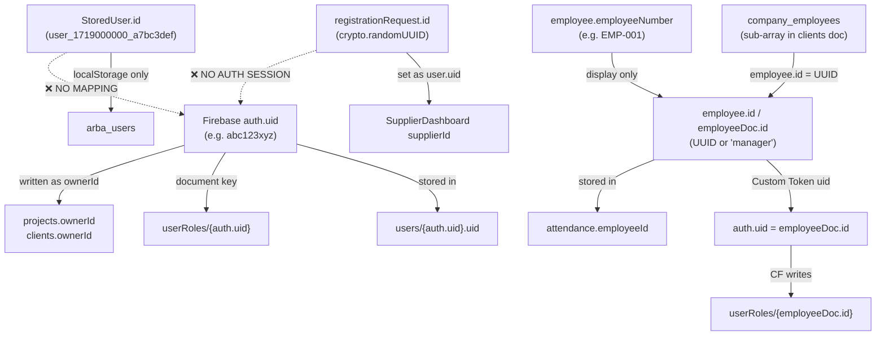

# خريطة الهوية — Identity Map

> كل مُعرِّف يمثل شخصاً في النظام، وكيف يرتبطون ببعضهم — أو أين ينقطع الربط.

---

## 0. الخلاصة العاجلة — هل كسر P1.1 شيئاً؟

### الموظف/المدير: لا كسر جديد من P1.1

| السؤال | الجواب | الدليل |
|---|---|---|
| هل مسار الموظف يُنشئ Firebase Auth session؟ | **نعم — عبر Custom Token** | App.tsx L697-702: `signInWithCustomToken(auth, customToken)` يُستدعى في L724 (مدير) و L757 (موظف) |
| من أين يأتي الـ Custom Token؟ | Cloud Function `verifyEmployeeCredentials` | functions/index.ts L1621: `admin.auth().createCustomToken(uid, claims)` حيث `uid = employeeDoc.id` |
| ما هو `auth.uid` الناتج؟ | **`employeeDoc.id`** — مفتاح وثيقة الموظف في `employees/` | L1614: `const uid = employeeDoc.id` ← للمدير = `'manager'`، للموظف = `emp.id` |
| ماذا يكتب الموظف كـ `ownerId`؟ | `user.uid` — لكن L749 **لا يُعيِّن uid** على الكائن! | `user?.uid || user?.email || 'demo'` يسقط إلى email/demo |
| **هل هذا مكسور بسبب P1.1؟** | **لا — مكسور من قبل P1.1** | القواعد القديمة (pre-P1.1) كانت `isAuth()` فقط. الموظف كان يملك Auth session عبر Custom Token، لكن `ownerId` كان دائماً `email` أو `'demo'` لأن `user.uid` لم يُعيَّن. المشكلة سابقة ولا علاقة لها بالقواعد الجديدة. |

> **⚠️ ثغرة واحدة سابقة (ليست من P1.1):** المدير في وضع offline fallback (L536) يعود **بدون customToken** ← لا يوجد Firebase Auth session ← كل كتابات Firestore تفشل (حتى `isAuth()` القديمة). هذا سلوك قائم منذ البداية.

### المورد: لا كسر جديد من P1.1 (لكن مكسور أصلاً)

| السؤال | الجواب |
|---|---|
| هل مسار المورد يُنشئ Firebase Auth session؟ | **لا — لا يوجد أي استدعاء لـ signIn** |
| ماذا يحدث عند دخول المورد؟ | App.tsx L797-810: `setUser({uid: registrationRequest.id, ...})` ثم `setCurrentPage('supplier')` — **بدون أي signIn** |
| هل كتابات المورد تعمل؟ | **لا — كانت تفشل قبل P1.1 أيضاً** — أي قاعدة `isAuth()` ترفضها |
| P1.1 impact? | **لا تأثير جديد** — المورد لم يكن يستطيع الكتابة أصلاً |

---

## 1. المُعرِّفات الستة



## 2. جدول المُعرِّفات

| # | المُعرِّف | الشكل | مكان التوليد | مكان التخزين |
|---|---|---|---|---|
| 1 | **`auth.uid`** | سلسلة Firebase | Firebase Auth `createUserWithEmailAndPassword` | `users/{uid}`, `userRoles/{uid}`, `ownerId` |
| 2 | **`StoredUser.id`** | `user_{timestamp}_{random9}` | services/authService.ts:200 | `localStorage` فقط |
| 3 | **`employee.id`** | UUID v4 / `'manager'` | employeeService.ts:83 / functions/index.ts:1544 | `employees/{id}`, `attendance.employeeId` |
| 4 | **`userRoles` doc key** | `auth.uid` (أو `employeeDoc.id` عبر CF) | authService.ts:164, rbacService.ts:45, **functions/index.ts:1629** | `userRoles/{key}` |
| 5 | **`employeeNumber`** | `EMP-{seq}` or `2201187` | يُعيَّن يدوياً | حقل عرض + بحث |
| 6 | **`registrationRequest.id`** ← **المورد** | `crypto.randomUUID()` | registrationService.ts:591,674,769 | `localStorage` (`registration_requests`). يُستخدم كـ `user.uid` بدون أي ربط بـ Firebase Auth |

---

## 3. سلاسل الربط

### ✅ السلسلة العاملة: SaaS User (Firebase Auth)

```
auth.uid ──→ users/{auth.uid}         ← doc key = auth.uid ✅
         ──→ userRoles/{auth.uid}     ← doc key = auth.uid ✅
         ──→ projects.ownerId         ← SaaSDashboard L117 يمرر user.uid ✅
         ──→ clients.ownerId          ← SaaSDashboard L159 يمرر userId ✅
```

### ⚠️ السلسلة المعقدة: Employee/Manager (Custom Token)

```
employeeDoc.id ──→ admin.auth().createCustomToken(uid) [CF L1621]
               ──→ signInWithCustomToken(auth, token) [App.tsx L702]
               ──→ auth.uid = employeeDoc.id ✅ (Firebase Auth session exists)
               ──→ userRoles/{employeeDoc.id} ← CF L1629 يكتبها ✅
               
BUT: App.tsx L749 setUser({...}) بدون uid!
     ──→ user.uid = undefined
     ──→ ownerId = user?.uid || user?.email || 'demo' ⚠️ يسقط إلى email
```

**ملاحظة:** auth.uid = `employeeDoc.id` (مثل UUID أو `'manager'`)، لكن `user.uid` في React state = `undefined` لأن `setUser` لا يُعيِّنه. هذا لا يؤثر على rules (`request.auth.uid` يأتي من الـ session وهو صحيح)، لكنه يؤثر على **قيمة `ownerId`** المكتوبة في المشاريع.

### ❌ السلسلة المكسورة: Supplier (NO Auth Session)

```
registrationRequest.id (UUID) ──→ user.uid = UUID [App.tsx L799]
                              ──→ supplierId = user.uid || user.email [App.tsx L1898]
                              
⛔ لا يوجد signIn ← لا يوجد auth.uid ← isAuth() = false
⛔ أي كتابة Firestore تفشل (حتى القواعد القديمة)
```

### ❌ السلسلة المكسورة: StoredUser (localStorage Auth)

```
StoredUser.id (user_timestamp) ──→ localStorage فقط
⛔ لا ربط بـ auth.uid
```

---

## 4. أثر P1.1 على المجموعات الست المُؤمَّنة

| المجموعة | الحقل المُثبَّت | القاعدة | من يكتب؟ | هل يعمل؟ |
|---|---|---|---|---|
| **projects** | `ownerId` | `request.resource.data.ownerId == request.auth.uid` | SaaS user عبر `user.uid` | ✅ SaaS user: `user.uid = auth.uid` |
| | | | Employee عبر `user?.uid || email` | ⚠️ `ownerId = email` ≠ `auth.uid` ← **يفشل** — لكن هذا **سابق لـ P1.1** |
| **clients** | `ownerId` | `request.resource.data.ownerId == request.auth.uid` | SaaS user | ✅ نفس المنطق |
| **suppliers** | `ownerId` | `request.resource.data.ownerId == request.auth.uid` | Sync layer | ✅ يمر عبر `auth.uid` |
| **supplierRFQs** | `clientId` | `request.resource.data.clientId == request.auth.uid` | `createRFQ(params)` | ⚠️ يعتمد على ما يمرره المستدعي — **لا يوجد مستدعي UI حالياً** |
| **supplierStoragePurchases** | `supplierId` | `request.resource.data.supplierId == request.auth.uid` | `purchaseStorage(supplierId)` | ⚠️ يعتمد على المستدعي — **لا يوجد مستدعي UI حالياً** |
| **security_alerts** | `reporterId` | `request.resource.data.reporterId == request.auth.uid` | **Cloud Functions فقط** (Admin SDK, bypasses rules) | ✅ القاعدة لا تُطبَّق — CF يكتب `userId` (وليس `reporterId`) عبر Admin SDK |

---

## 5. ملخص نقاط الانكسار

| # | الانكسار | الخطورة | هل من P1.1؟ | التأثير |
|---|---|---|---|---|
| **B1** | `StoredUser.id` ↔ `auth.uid` — لا ربط | 🔴 | **لا** — سابق | Local auth path يتيم |
| **B2** | Employee `setUser` لا يُعيِّن `uid` | 🟡 | **لا** — سابق | `ownerId` يسقط إلى `email` بدلاً من `auth.uid` |
| **B3** | Manager offline fallback بدون `customToken` | 🟡 | **لا** — سابق | لا Firebase session ← كل Firestore writes تفشل |
| **B4** | Supplier path — لا signIn إطلاقاً | 🔴 | **لا** — سابق | لا auth session ← كل Firestore writes تفشل |
| **B5** | `security_alerts` — field mismatch (`userId` vs `reporterId`) | 🟢 | لا | غير مؤثر — CF يستخدم Admin SDK (يتجاوز القواعد) |

> **الحكم: P1.1 لم يكسر شيئاً لم يكن مكسوراً أصلاً.**
